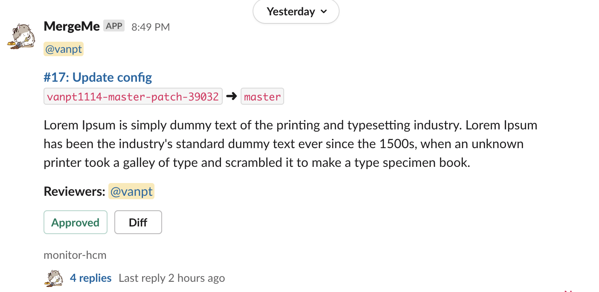

# MergeMe

A small tool that I think it just suitable for **`DevOps/SRE`** team to get notify about MRs in some repositories to quickly review and approve the MRs via Slack.

### Prerequisites:
- Redis
- Slack bot (with chat.write permission)
- Slack token
- Gitlab and Gitlab token
- Project mappings file (default.yaml)

### Setup

Required environment variables:
- GITLAB_URL
- GITLAB_TOKEN
- SLACK_TOKEN
- REDIS_HOST (Ex: 127.0.0.1:6279)

Optional:
- REDIS_DB
- REDIS_PASSWORD