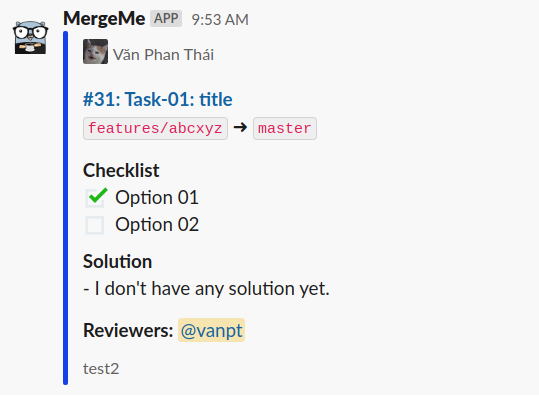
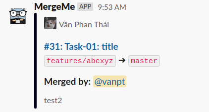

# MergeMe

A simple app that will route Merge request events on gitlab to different channels in Slack.

### Usage: ###
- Define your project ID along with the slack channel that you want to route to message to in config/allow.go

*Prerequisites:*
- Redis for caching gitlab merge request ID
- Slack API Token with bot:write privilege.
- Gitlab read api token.